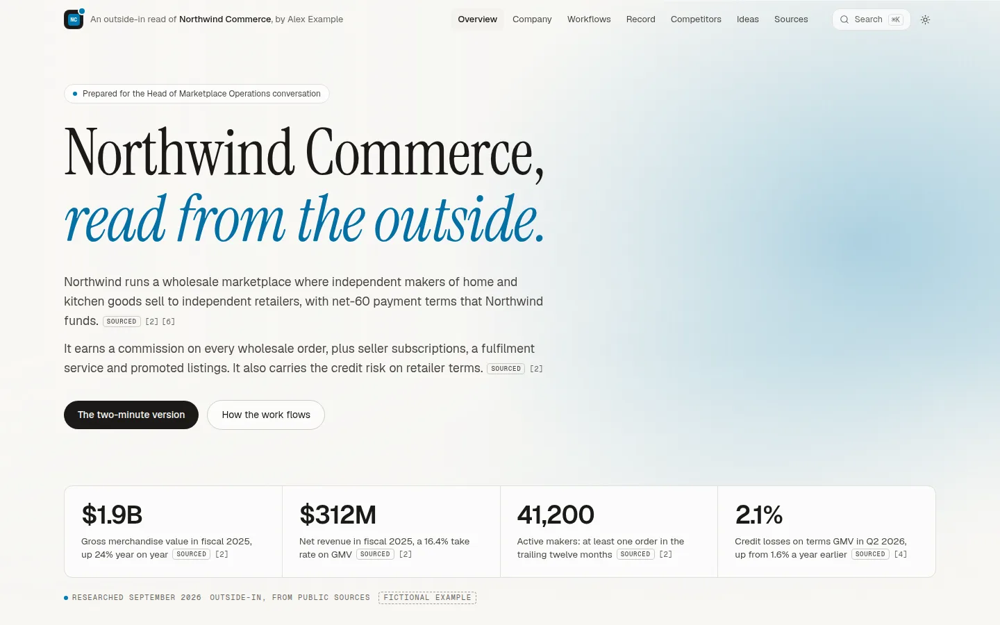
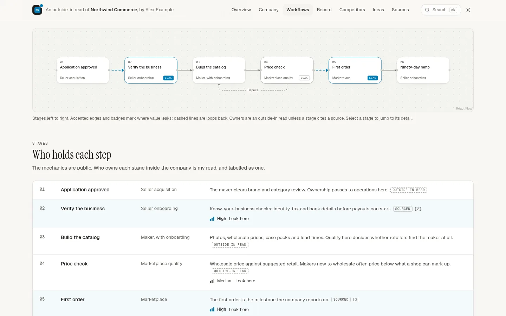
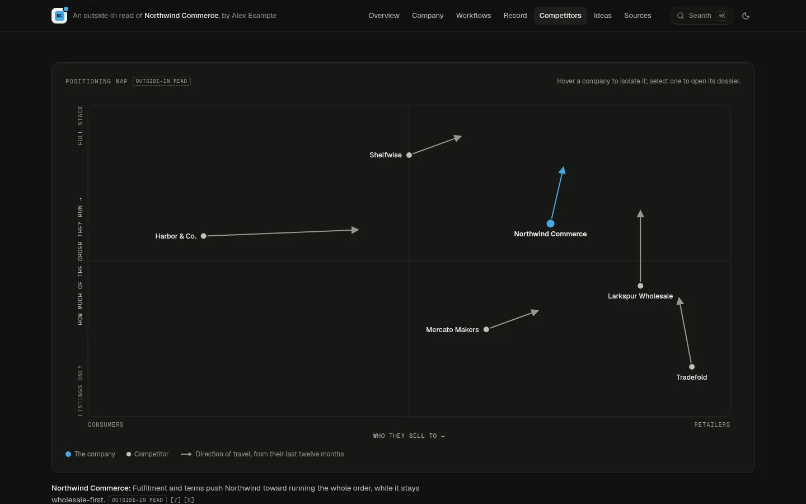
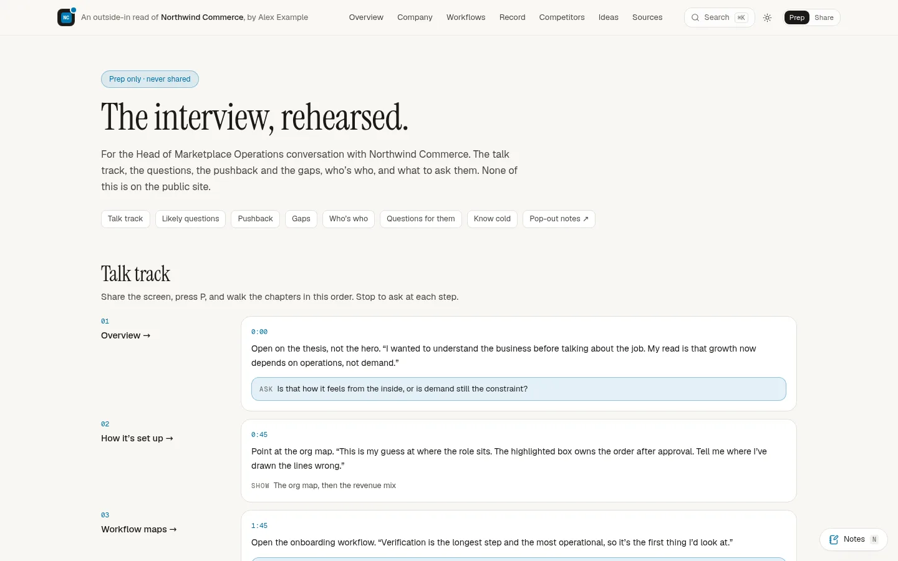

# company-audit

**Walk into an interview having already done the job's homework, and show it.**

company-audit builds a small website about one company, read through the one
role you're interviewing for. It shows how the business is set up, how the
work in the role flows, what the company has said publicly, who it competes
with, and what you'd do first. It reads like an operator wrote it, and every
claim says whether it's **sourced**, your **outside-in read**, or an
**illustrative model**.

Behind a key, the same site is your interview prep: a talk track for each page
while you share your screen, likely questions, pushback, gaps, who's who, and
questions to ask. Prep is committed only in encrypted form, so the whole repo
can be public, and only you hold the key, so deploying takes no variables.

You don't write it by hand. Install the skill, give Claude the company and
the job link, and it researches, writes, fact-checks and deploys the site.

The template ships with **Northwind Commerce, a fictional company**, as the
example.

**Live demo:** [the public site](https://site-production-7a10.up.railway.app),
and [the same site in the prep view](https://site-production-7a10.up.railway.app/?prep=demo).
The demo's key is `demo` because the company is invented. Yours will be a long
random key.

| | |
| --- | --- |
|  |  |
|  |  |

---

## Make one

### With the Claude skill (easiest)

1. Download `company-audit-skill.zip` from the
   [latest release](https://github.com/byw1/company-audit/releases) (or the
   `skills/company-audit` folder).
   - **Claude Code**: unzip it into `~/.claude/skills/`.
   - **claude.ai**: Settings → Capabilities → Skills → upload the zip.
2. Ask Claude:

   > /company-audit Acme acme.com https://jobs.acme.com/head-of-ops

   It asks for your name, email, LinkedIn and where your experience lives
   (a resume file, your LinkedIn export, notes), then:
   - creates `<you>/acme-audit` from this template;
   - researches the company and the role;
   - writes your sealed prep;
   - runs a separate fact-check pass that rates every claim BLOCKER / FIX / NOTE;
   - proves nothing private leaks, and deploys.

The skill does the most from Claude Code, which can run the commands.

### From the template, in Claude Code

```bash
gh repo create <you>/acme-audit --template byw1/company-audit --public --clone
cd acme-audit && npm install
npm run new -- --company "Acme" --domain acme.com --jd https://jobs.ashbyhq.com/acme/…
npm run status                         # the checklist, and what to do next
claude                                 # then: /new-audit, and follow `npm run status`
```

`npm run new` fetches the posting and saves it verbatim. For Ashby,
Greenhouse and Lever it also checks the role is still on the careers index.
Then it writes the config, loads your author profile, names the site, and
makes your prep key.

`npm run status` then tracks the audit from setup to deploy, in 18 steps.
It works progress out from the files, so you or Claude can stop and pick up
any time:

```
  Mercor · Head of Operations Planning

  ✓  1. Started for a real company and role
  ✓  2. Your byline and rules (content/author.md)
  …
  ·  5. Research: company.ts  (still has the example)
  …
  5/18 done.
  Next: Replace the fictional example in content/company.ts (/new-audit, step 2)
```

`/new-audit` is the full research playbook (`.claude/commands/new-audit.md`).
`CLAUDE.md` holds the rules it follows.

### Your profile, once

Your byline (name, email, LinkedIn) and your rules (`content/author.md`: what
must or mustn't be said about you, and where your evidence lives) are the same
for every audit. Fill them in once and run `npm run author:save`. They go to
`~/.config/company-audit/`, and every `npm run new` starts with them.

### By hand

Everything company-specific is in `content/`. Each file's example shows the
shape, and `npm run validate` says exactly what's wrong:

```bash
npm run new -- --company … --domain … --jd …   # or edit content/audit.config.ts and run npm run prep:init
npm run dev           # http://localhost:3000; it prints the link that unlocks your prep
npm run validate      # as you go
npm run logos         # icons, accent, favicon and link-preview images
npm run prep:seal     # encrypt your prep before committing
npm run verify:share  # must pass before you send the link
```

## How prep stays private in a public repo

- `content/prep.ts` holds your notes in plain text. It's **gitignored**: it
  never leaves your machine.
- `npm run prep:seal` encrypts it into `content/prep.sealed.json`, with
  AES-256-GCM and a key derived from your `PREP_KEY`. That file is what's
  committed and deployed. Without the key it's noise.
- `PREP_KEY` is a random key that `npm run prep:init` puts in `.env.local`
  (gitignored). It's the only key, and only you hold it: not the host, not
  the repo, not CI. That's why there's nothing to set when you deploy. Keep a
  copy in your password manager.
- To see your prep, visit any page once with `?prep=<PREP_KEY>`. The server
  derives the decryption key, checks it against the sealed file, and keeps it
  in an httpOnly cookie for 60 days. `?prep=off` forgets it.

The server has no key of its own, so it can decrypt prep only for a request
that brings one, and only once it has decided that request is the prep view.
In the share view, prep isn't hidden with CSS: it's never rendered, so it
isn't in the HTML, the RSC payload or any JavaScript.

If the key ever leaks, delete `PREP_KEY` from `.env.local`, run
`npm run prep:init` and `npm run prep:seal`, and redeploy. Versions already
pushed stay readable with the old key, as with any encrypted file in a public
repo.

Four layers enforce this:

1. **Sealing.** No plain prep ever reaches git. `verify:share` fails if
   `content/prep.ts` is tracked.
2. **ESLint.** Public code can't import prep. The only door is `<PrepLayer>`,
   which renders nothing in the share view.
3. **`server-only`.** The build fails if prep ever reaches a client bundle.
4. **`npm run verify:share`.** It builds the site and proves it on the result
   (see Checks).

## Deploy

There's nothing to configure: no variables, no secrets, no config file. The
sealed prep ships with the site, and only the key you bring opens it.

### Railway

From GitHub, so every push redeploys:

1. [New project](https://railway.com/new) → **Deploy from GitHub repo** →
   your audit repo.
2. The service → **Settings → Networking → Generate Domain**.
3. `npm run deployed -- https://<your-domain>` records the URL for
   `npm run status`. It also checks the live site: it answers, `/prep` is
   404 without the key, and your key opens it.

Or from the terminal, in one command:

```bash
npm run deploy:railway   # signs you in, creates the project, deploys, gives it a URL
```

The first run signs you in to Railway, or makes you an account. It creates a
project named after the audit, deploys this folder and generates a domain,
then checks the live site the same way. Later runs redeploy. It uploads what
git would commit, so `content/prep.ts` and `.env.local` stay on your machine.

With Claude's Railway connector, the skill does the GitHub route for you.
Railway builds with `npm run build` and serves with `npm start`, which binds
`$PORT`.

### Cloudflare Workers

The site runs on Workers through [OpenNext](https://opennext.js.org/cloudflare).
No R2, KV or database is needed: pages render per request from `content/`, and
the images are static files.

```bash
npx wrangler login     # once per machine (or set CLOUDFLARE_API_TOKEN)
npm run deploy:cf      # → https://acme-audit.<your-subdomain>.workers.dev
```

`deploy:cf` refuses to ship stale sealed prep. It builds and deploys the
Worker (`npm run new` already named it `<company>-audit`), then checks the
live site.

Also:
- `npm run cf:preview` runs the same build locally in Cloudflare's runtime.
- **Custom domain:** add it in the Worker's settings. Link previews follow the
  domain the site is served from, so there's nothing else to set.
- **Deploy on every push:** connect the repo under Workers → your Worker →
  Settings → Builds, with build command `npx opennextjs-cloudflare build` and
  deploy command `npx opennextjs-cloudflare deploy`.
- **Plan:** the free plan allows 10 ms of CPU per request. If pages fail with
  error 1102, move to Workers Paid.

### Send it

Open `https://<your-site>/?prep=<PREP_KEY>` once; the deploy commands print
that link. Use the **Prep / Share** toggle in the header to preview exactly
what a recipient sees, then send the plain URL.

## What's on the site

| Route | What |
| --- | --- |
| `/` | The thesis in one scroll: what the company is and how it makes money, the numbers that matter, the three things you'd say in two minutes, then each chapter's strongest picture |
| `/company` | The org drawn around the role (reports to, peers, upstream, downstream), business model, revenue lines, timeline, funding, leadership |
| `/workflows` | The JD line by line, mapped to workflows; each workflow at `/workflows/{id}` as a flowchart with owners, leaks, KPIs and the first change you'd make |
| `/record` | Everything they've said publicly, as a ledger of what they said → what it implies for the role, plus hiring signals |
| `/competitors` | A positioning map with each competitor's direction of travel, and a sortable table that opens into dossiers |
| `/ideas` | Initiatives ranked by impact and effort, each traced to a leak, a stated plan or a competitor move, and the first 90 days |
| `/sources` | Every source, numbered, grouped and dated |
| `/fit` | Optional, off by default: JD requirement → your evidence |
| `/prep` | Key only, 404 otherwise: talk track, questions, pushback, gaps, who's who, questions for them |

Chapters can be switched off in `content/audit.config.ts`. A switched-off
chapter 404s.

- **⌘K** (or `/`) searches every chapter, workflow, stage, leak, competitor,
  record item, idea and source. Every item has a deep link.
- **Presenter mode:** `?present`, or press **P**. It hides the chrome and
  enlarges the type; **← →** step through the chapters and **Esc** leaves.
- **Talk-track notes** (prep view only): press **N** for a drawer with the
  note for the chapter on screen. **Pop out** opens a window that follows
  along on a second screen while you share the main one. Presenter mode
  always closes the drawer.
- **Save as PDF** is in the footer. Print expands everything and forces the
  light theme.

## Every claim is labelled

| Label | Meaning |
| --- | --- |
| **Sourced** | Taken from a public source, with its link and the date it was read |
| **Outside-in read** | Your inference from public evidence, not inside knowledge |
| **Illustrative model** | Invented numbers that show how a mechanism works |

Content is written with `sourced()`, `quote()`, `read()`, `model()` and
`stat()` from `lib/claims.ts`, and validated with Zod. `npm run validate`
prints every problem at once, with a "did you mean". It fails on:

- an unlabelled claim, or a figure in a plain-text field;
- a source id that doesn't exist, or a source dated in the future;
- a JD quote that isn't word for word in `content/jd.md`;
- a workflow that doesn't map to the JD, or a leak at a stage that doesn't
  exist;
- an idea that doesn't trace to anything.

The rules Claude writes by, such as no inside information, real numbers only,
and one source per claim, are in `CLAUDE.md`. Rules about you (how you're
described, what stays off) go in `content/author.md`.

## Checks

```bash
npm run status        # the whole checklist, and the next step
npm run jd -- <URL>   # is the role still listed? Run it again the day before the interview
npm run check         # validate + typecheck + lint
npm run prep:status   # is the sealed prep current with content/prep.ts?
npm run verify:share  # the share view leaks nothing
npm run lighthouse    # Lighthouse CI against a local production server
```

`verify:share` builds the site and starts it with no prep variables, as a
host would. It opens your sealed prep with your key (or seals your
`content/prep.ts` with a throwaway one) and derives probes from every string
in it. Then it:

- crawls every route in the share view and checks:
  - the raw server HTML, after stripping React's `<!-- -->` separators and
    decoding entities;
  - the RSC payload a client-side navigation would fetch;
  - the rendered DOM in Chromium, with the ⌘K palette open;
  - the search index;
  - every JS and CSS chunk the build ships;
- repeats the checks in the share preview;
- asserts that `/prep` is 404 without the key, with forged cookies (the raw
  key among them) and under `?share`;
- runs a **control**: the same probes must appear in the prep view, so a pass
  can't come from probes that match nothing;
- fails if `content/prep.ts` is tracked by git, and warns if it's in the
  history.

**CI** (`.github/workflows/ci.yml`) runs on every push:

- validate, typecheck, lint and build;
- `verify:share`;
- the Cloudflare build, with the Worker's size;
- Lighthouse on `/`: the median of five mobile runs must score 95+ for
  performance and accessibility.

CI needs no secrets. In the template, `verify:share` checks the example prep
word for word. In an audit repo your prep stays sealed in CI, so it checks the
gate: `/prep` is 404 and forged cookies open nothing. The word-for-word check
runs on your machine, and `npm run status` doesn't tick it off until it has.

## Logos, favicon, accent

`npm run logos` caches an icon for every domain in `content/` (the company,
competitors, and each source's host) from [Twenty's favicon
service](https://github.com/twentyhq/favicon) into `public/logos/`. Then it
derives the accent and draws the favicon, home-screen icon and link preview
into `app/*.png`.

- **Fallbacks:** anything that 404s, or sits on a reserved TLD like
  `.example`, becomes a monogram tile in the accent. If the company's own
  domain has no icon, set `company.iconDomain` to another of its domains that
  has one; the script says when.
- **Committed output:** the build never fetches, nothing is drawn at runtime,
  and the site works offline. Re-run it when a domain is added or the company,
  role or author changes.
- **The accent** comes from the company's icon. It's lifted to a minimum
  chroma, then darkened or lightened until it clears contrast on every
  surface. Greyscale icons get a curated hue. Override it with `accent` in
  `audit.config.ts`.
- **The favicon** is the company's icon inside your frame: a dark rounded tile
  with an accent dot. The tab is recognisable, but the site never looks like
  the company's own property. The header always reads "An outside-in read of
  {Company}, by {you}".

## Design

- **Tokens** live on `:root` in `app/globals.css`:
  - a warm-paper light mode and a warm-charcoal dark mode;
  - text tokens clear WCAG AA on every surface;
  - the theme follows the OS, with a toggle.
- **One accent**, used only for what moves money or needs attention.
- **Type:**
  - Instrument Serif for headlines;
  - Geist for prose;
  - Geist Mono for labels and numbers.

  All three load from npm as latin subsets.
- **The hero is a slot:** `shader`, `particles` or `flywheel` (3D), set in
  `audit.config.ts`. It starts on the visitor's first interaction, over a
  static gradient. It pauses off-screen, and renders a still frame for
  reduced motion or slow devices.
- **shadcn/ui** is set up in `components.json`, with 21st.dev's registry as
  `@21st` (needs `TWENTY_FIRST_API_KEY`). Restyle anything you pull in.

## Pulling template improvements into an older audit

```bash
npm run template:update
```

It adds the template as a remote, merges its latest `main`, and keeps
everything that's yours: `content/`, `public/logos/`, the generated images and
`wrangler.jsonc`. It commits only if `npm run check` passes afterwards. If the
content schema changed, `npm run validate` says exactly what to update.

Audits from before keyless deploys sealed prep with `PREP_SECRET`, which the
host had to hold. The update re-seals it with your `PREP_KEY`; after you
redeploy, delete both variables from the host.

## Notes

- **Node 22** is pinned (`.nvmrc`, `engines.node`).
- **`noindex`**, via metadata and an `X-Robots-Tag` header: the site is for
  the people you send it to, not for search.
- **Rendered per request**, because the view is decided per request. Pages
  carry `Cache-Control: private, no-store`, so no shared cache can hand the
  prep view to someone else.
- `docs/first-audits.md` records the first two real audits built on the
  template, and what they changed.

## Improving the template

See `CONTRIBUTING.md`. In short:
- framework changes go in `app/`, `components/`, `lib/` and `scripts/`;
- keep the Northwind example coherent;
- `npm run check`, `npm run verify:share` and `npm run cf:build` must pass.

## License

MIT. See `LICENSE`.
